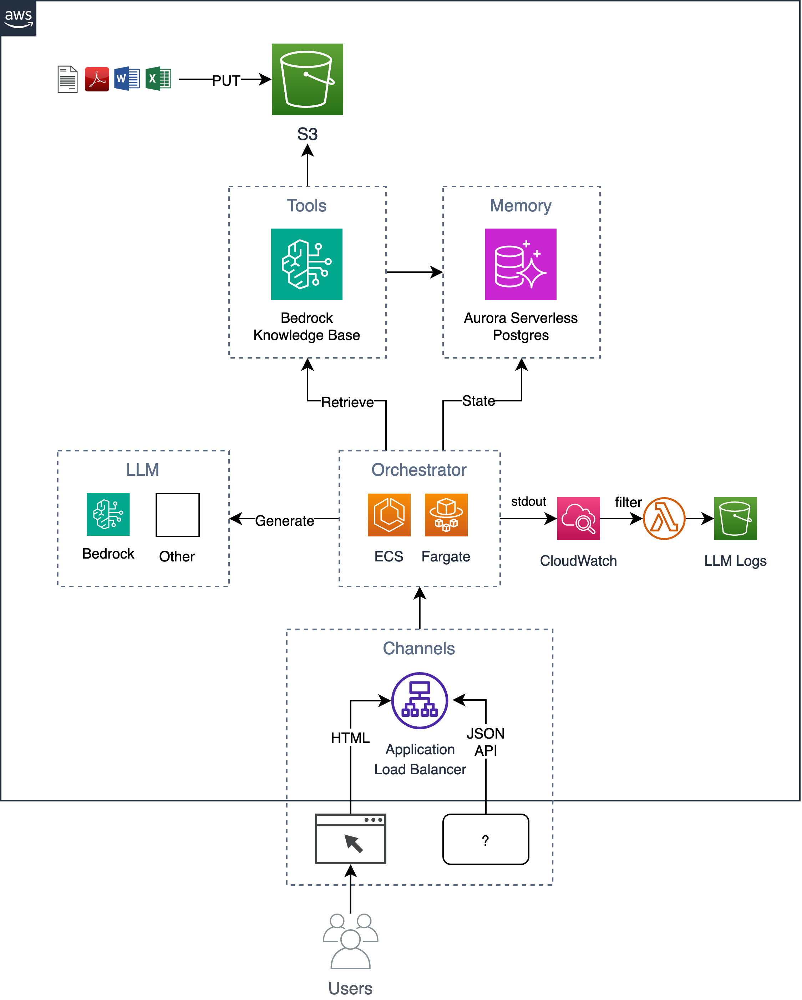

# ai-chat-accelerator

Get up and running quickly with an AI chat application on AWS that provides a foundation to build upon.

An example of a simple, yet scalable, enterprise-ready chatbot that implements the retrieval augmented generation (RAG) pattern without taking a dependency on any Python frameworks/libraries. It uses [Bedrock Knowledge Bases](https://aws.amazon.com/bedrock/knowledge-bases/) to ingest documents in an [S3 bucket](https://aws.amazon.com/s3/) and store the indexed vectors in a [Postgres](https://www.postgresql.org/) database hosted in [Aurora Serverless](https://aws.amazon.com/rds/aurora/serverless/). This database also serves as the application database storing information such as user conversation history. The app implements both a web GUI as well as an HTTP JSON API and is hosted as a container running on [ECS Fargate](https://docs.aws.amazon.com/AmazonECS/latest/developerguide/AWS_Fargate.html) fronted with an [ALB](https://aws.amazon.com/elasticloadbalancing/application-load-balancer/). The app is built using [Flask](https://flask.palletsprojects.com) and [HTMX](https://htmx.org/).




## Usage

Follow the 6 step process below for deploying this solution into your AWS account.

1. Setup/Install prerequisites
2. Deploy cloud infrastructure
3. Deploy application code
4. Upload your documents to the generated S3 bucket
5. Trigger the Bedrock Knowledge Base sync
6. Start chatting with your documents in the app


### 1. Setup/Install prerequisites

- [Enable the Bedrock models you are using for both the KB ingestion and app generation](https://docs.aws.amazon.com/bedrock/latest/userguide/model-access.html)
- [AWS CLI](https://docs.aws.amazon.com/cli/latest/userguide/getting-started-install.html)
- [Terraform](https://developer.hashicorp.com/terraform/tutorials/aws-get-started/install-cli)
- [Docker Desktop](https://www.docker.com/products/docker-desktop/)
- [jq CLI](https://jqlang.github.io/jq/download/)


### 2. Deploy cloud infrastructure

Export required environment variables.

```sh
export AWS_REGION=$(aws configure get region || echo "us-east-1")
export ACCOUNT=$(aws sts get-caller-identity --query Account --output text)
export BUCKET=tf-state-${ACCOUNT}
```

Optionally, create an s3 bucket to store terraform state (this is recommended since the initial db password will be stored in the state). If you already have an s3 bucket, you can update the `BUCKET` variable with the name of your bucket (e.g., `export BUCKET=my-s3-bucket`).

```sh
aws s3 mb s3://${BUCKET}
```

Set template input parameters, like app `name` in `terraform.tfvars`.

```sh
cd iac
cat << EOF > terraform.tfvars
name = "ai-chatbot"
tags = {
  app = "ai-chatbot"
}
EOF
```

Deploy using terraform.

```sh
terraform init -backend-config="bucket=${BUCKET}" -backend-config="key=ai-chatbot.tfstate"
terraform apply
```


### 3. Deploy application code

Now that the infrastructure has been deployed, you can build the app container and deploy it on top of the infrastructure.

*Note that if you changed the app name from `ai-chatbot` to something else, you'll need to pass that to the make command using the `app` parameter (or change it at the top of `Makefile`).

The first time you deploy you can run the following to build the base image and app image together.

```sh
cd ../
make baseimage && make deploy
```

After the intitial deployment, you can iterate on code changes faster by only rebuilding the code layers and re-deploying.

```sh
make deploy
# OR
# make deploy app=my-cool-chatbot
```


### 4. Upload your documents to the generated S3 bucket

```sh
cd iac
export DOCS_BUCKET=$(terraform output -raw s3_bucket_name)
aws s3 cp /path/to/docs/ s3://${DOCS_BUCKET}/ --recursive
```


### 5. Call the Bedrock Knowledge Base Sync API

```sh
cd iac
make sync
```
Note that this script calls the `bedrock-agent start-ingestion-job` API.  This job will need to successfully complete before the chatbot will be able to answer questions about your documents.


### 6. Start chatting with your documents in the app

```sh
open $(terraform output -raw endpoint)
```


## API

In addition to the simple HTMX GUI, there is an HTTP JSON API that supports the following actions.

```sh
export endpoint=$(terraform output -raw endpoint)
```


### POST /api/ask

Ask a question and get back an answer.

```sh
curl -s -X POST -H "Content-Type: application/json" $endpoint/api/ask \
  -d '{ "question": "Who are you?" }' | jq
```
<details>
<summary>output</summary>

```json
{
  "answer": "...",
  "conversationId": "46ac5045-49b4-487c-b3a0-64d82462ad76"
}
```
</details>

To ask a follow up question as part of a conversation, include the conversation id in the URL.

```sh
curl -s -X POST -H "Content-Type: application/json" $endpoint/api/ask/46ac5045-49b4-487c-b3a0-64d82462ad76 -d '{ "question": What are you capable of?" }' | jq
```
<details>
<summary>output</summary>

```json
{
  "answer": "...",
  "conversationId": "46ac5045-49b4-487c-b3a0-64d82462ad76"
}
```
</details>

### GET /api/conversations

Return the latest 10 conversations

```sh
curl -s $endpoint/api/conversations | jq
```
<details>
<summary>output</summary>

```json
[
  {
    "conversationId": "d61e143c-a32d-4b4f-aa4e-a0fe94082e77",
    "created": "2024-04-10T22:04:36.813819+00:00",
    "questions": [
      {
        "a": "...",
        "created": "2024-04-10 22:04:40.657402+00:00",
        "q": "..."
      }
    ],
    "userId": "1"
  },
  {
    "conversationId": "aaddc6aa-7c51-4b0a-800d-53e72b05524f",
    "created": "2024-04-10T22:01:16.071982+00:00",
    "questions": [
      {
        "a": "...",
        "created": "2024-04-10 22:01:18.500971+00:00",
        "q": "..."
      },
      {
        "a": "...",
        "created": "2024-04-10 22:01:27.328482+00:00",
        "q": "..."
      }
    ],
    "userId": "1"
  }
]
```
</details>

### GET /api/conversations/{conversationId}

Return information about the specified conversation

```sh
curl -s $endpoint/api/conversations/d61e143c-a32d-4b4f-aa4e-a0fe94082e77 | jq
```
<details>
<summary>output</summary>

```json
{
  "conversationId": "d61e143c-a32d-4b4f-aa4e-a0fe94082e77",
  "created": "2024-04-10T22:04:36.813819+00:00",
  "questions": [
    {
      "a": "...",
      "created": "2024-04-10 22:04:40.657402+00:00",
      "q": "..."
    }
  ],
  "userId": "1"
}
```
</details>


## Development

```
 Choose a make command to run

  init           run this once to initialize a new python project
  install        install project dependencies
  start          run local project
  baseimage      build base image
  deploy         build and deploy container
  up             run the app locally using docker compose
  down           stop the app
  start-docker   run local project using docker compose
```


### Running locally

In order to run the app locally, create a local file named `.env` with the following variables. The variable, `KNOWLEDGE_BASE_ID` comes from the Terraform output (`cd iac && terraform output`).

```sh
POSTGRES_DB=postgres
POSTGRES_USER=postgres
POSTGRES_PASSWORD=xyz
KNOWLEDGE_BASE_ID=
```

After setting up your `.env` file, you can run the app locally in docker to iterate on code changes before deploying to AWS. When running the app locally it talks to a local postgres database and uses the remote Amazon Bedrock Knowledge Base API. Ensure that you have valid AWS credentials. Running the `make up` command will start a postgres database instance and a web container.

```sh
make up
```

To stop the environment simply run:

```sh
make down
```
