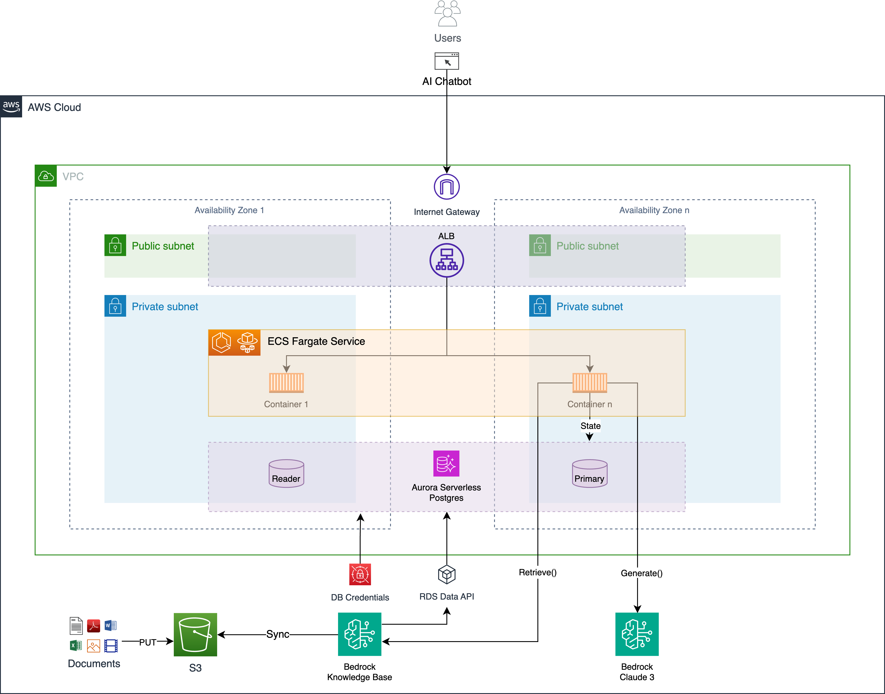

# IaC

This repo uses [asdf](https://asdf-vm.com/) to manage the `terraform` CLI and the various other tools it depends upon.




```
 Choose a make command to run

  init    project initialization - install tools and register git hook
```

<!-- BEGINNING OF PRE-COMMIT-TERRAFORM DOCS HOOK -->
## Requirements

| Name | Version |
|------|---------|
| <a name="requirement_terraform"></a> [terraform](#requirement\_terraform) | >= 1.0 |
| <a name="requirement_aws"></a> [aws](#requirement\_aws) | ~> 5.0 |
| <a name="requirement_local"></a> [local](#requirement\_local) | ~> 2.0 |
| <a name="requirement_null"></a> [null](#requirement\_null) | ~> 3.0 |
| <a name="requirement_random"></a> [random](#requirement\_random) | ~> 3.0 |

## Providers

| Name | Version |
|------|---------|
| <a name="provider_archive"></a> [archive](#provider\_archive) | n/a |
| <a name="provider_aws"></a> [aws](#provider\_aws) | ~> 5.0 |
| <a name="provider_awscc"></a> [awscc](#provider\_awscc) | n/a |
| <a name="provider_null"></a> [null](#provider\_null) | ~> 3.0 |
| <a name="provider_random"></a> [random](#provider\_random) | ~> 3.0 |

## Modules

| Name | Source | Version |
|------|--------|---------|
| <a name="module_alb"></a> [alb](#module\_alb) | terraform-aws-modules/alb/aws | ~> 9.0 |
| <a name="module_aurora_postgres"></a> [aurora\_postgres](#module\_aurora\_postgres) | terraform-aws-modules/rds-aurora/aws | n/a |
| <a name="module_ecs_cluster"></a> [ecs\_cluster](#module\_ecs\_cluster) | terraform-aws-modules/ecs/aws//modules/cluster | ~> 5.6 |
| <a name="module_ecs_service"></a> [ecs\_service](#module\_ecs\_service) | terraform-aws-modules/ecs/aws//modules/service | ~> 5.6 |
| <a name="module_vpc"></a> [vpc](#module\_vpc) | terraform-aws-modules/vpc/aws | ~> 5.0 |

## Resources

| Name | Type |
|------|------|
| [aws_bedrockagent_data_source.main](https://registry.terraform.io/providers/hashicorp/aws/latest/docs/resources/bedrockagent_data_source) | resource |
| [aws_bedrockagent_knowledge_base.main](https://registry.terraform.io/providers/hashicorp/aws/latest/docs/resources/bedrockagent_knowledge_base) | resource |
| [aws_cloudwatch_log_group.llm_logs](https://registry.terraform.io/providers/hashicorp/aws/latest/docs/resources/cloudwatch_log_group) | resource |
| [aws_cloudwatch_log_subscription_filter.llm_logs](https://registry.terraform.io/providers/hashicorp/aws/latest/docs/resources/cloudwatch_log_subscription_filter) | resource |
| [aws_ecr_repository.main](https://registry.terraform.io/providers/hashicorp/aws/latest/docs/resources/ecr_repository) | resource |
| [aws_iam_role.bedrock_kb_role](https://registry.terraform.io/providers/hashicorp/aws/latest/docs/resources/iam_role) | resource |
| [aws_iam_role.event_bridge_scheduler](https://registry.terraform.io/providers/hashicorp/aws/latest/docs/resources/iam_role) | resource |
| [aws_iam_role.lambda_llm_logs](https://registry.terraform.io/providers/hashicorp/aws/latest/docs/resources/iam_role) | resource |
| [aws_iam_role_policy.event_bridge_scheduler](https://registry.terraform.io/providers/hashicorp/aws/latest/docs/resources/iam_role_policy) | resource |
| [aws_iam_role_policy.kb](https://registry.terraform.io/providers/hashicorp/aws/latest/docs/resources/iam_role_policy) | resource |
| [aws_iam_role_policy.lambda_llm_logs](https://registry.terraform.io/providers/hashicorp/aws/latest/docs/resources/iam_role_policy) | resource |
| [aws_iam_role_policy_attachment.cw_subscription](https://registry.terraform.io/providers/hashicorp/aws/latest/docs/resources/iam_role_policy_attachment) | resource |
| [aws_iam_role_policy_attachment.lambda_basic_execution](https://registry.terraform.io/providers/hashicorp/aws/latest/docs/resources/iam_role_policy_attachment) | resource |
| [aws_lambda_function.log_to_s3](https://registry.terraform.io/providers/hashicorp/aws/latest/docs/resources/lambda_function) | resource |
| [aws_lambda_permission.llm_logs](https://registry.terraform.io/providers/hashicorp/aws/latest/docs/resources/lambda_permission) | resource |
| [aws_s3_bucket.kb_logs](https://registry.terraform.io/providers/hashicorp/aws/latest/docs/resources/s3_bucket) | resource |
| [aws_s3_bucket.llm_logs](https://registry.terraform.io/providers/hashicorp/aws/latest/docs/resources/s3_bucket) | resource |
| [aws_s3_bucket.main](https://registry.terraform.io/providers/hashicorp/aws/latest/docs/resources/s3_bucket) | resource |
| [aws_s3_bucket_public_access_block.kb_logs](https://registry.terraform.io/providers/hashicorp/aws/latest/docs/resources/s3_bucket_public_access_block) | resource |
| [aws_s3_bucket_public_access_block.main](https://registry.terraform.io/providers/hashicorp/aws/latest/docs/resources/s3_bucket_public_access_block) | resource |
| [aws_scheduler_schedule.main](https://registry.terraform.io/providers/hashicorp/aws/latest/docs/resources/scheduler_schedule) | resource |
| [aws_secretsmanager_secret.kb_creds](https://registry.terraform.io/providers/hashicorp/aws/latest/docs/resources/secretsmanager_secret) | resource |
| [aws_secretsmanager_secret_version.v1](https://registry.terraform.io/providers/hashicorp/aws/latest/docs/resources/secretsmanager_secret_version) | resource |
| [awscc_logs_delivery.kb_logs](https://registry.terraform.io/providers/hashicorp/awscc/latest/docs/resources/logs_delivery) | resource |
| [awscc_logs_delivery_destination.kb_logs](https://registry.terraform.io/providers/hashicorp/awscc/latest/docs/resources/logs_delivery_destination) | resource |
| [awscc_logs_delivery_source.kb_logs](https://registry.terraform.io/providers/hashicorp/awscc/latest/docs/resources/logs_delivery_source) | resource |
| [null_resource.postgres_setup](https://registry.terraform.io/providers/hashicorp/null/latest/docs/resources/resource) | resource |
| [random_password.kb_password](https://registry.terraform.io/providers/hashicorp/random/latest/docs/resources/password) | resource |
| [archive_file.llm_logs](https://registry.terraform.io/providers/hashicorp/archive/latest/docs/data-sources/file) | data source |
| [aws_availability_zones.available](https://registry.terraform.io/providers/hashicorp/aws/latest/docs/data-sources/availability_zones) | data source |
| [aws_caller_identity.current](https://registry.terraform.io/providers/hashicorp/aws/latest/docs/data-sources/caller_identity) | data source |
| [aws_iam_policy_document.kb](https://registry.terraform.io/providers/hashicorp/aws/latest/docs/data-sources/iam_policy_document) | data source |
| [aws_iam_policy_document.kb_assume](https://registry.terraform.io/providers/hashicorp/aws/latest/docs/data-sources/iam_policy_document) | data source |
| [aws_iam_policy_document.kb_sync](https://registry.terraform.io/providers/hashicorp/aws/latest/docs/data-sources/iam_policy_document) | data source |
| [aws_rds_engine_version.postgres](https://registry.terraform.io/providers/hashicorp/aws/latest/docs/data-sources/rds_engine_version) | data source |
| [aws_region.current](https://registry.terraform.io/providers/hashicorp/aws/latest/docs/data-sources/region) | data source |

## Inputs

| Name | Description | Type | Default | Required |
|------|-------------|------|---------|:--------:|
| <a name="input_container_name"></a> [container\_name](#input\_container\_name) | The name of the container | `string` | `"app"` | no |
| <a name="input_container_port"></a> [container\_port](#input\_container\_port) | The port that the container is listening on | `number` | `8080` | no |
| <a name="input_health_check"></a> [health\_check](#input\_health\_check) | A map containing configuration for the health check | `string` | `"/health"` | no |
| <a name="input_image"></a> [image](#input\_image) | container image to initially bootstrap. future images can be deployed using a separate mechanism | `string` | `"public.ecr.aws/jritsema/defaultbackend"` | no |
| <a name="input_name"></a> [name](#input\_name) | The name of this template (e.g., my-app-prod) | `string` | n/a | yes |
| <a name="input_region"></a> [region](#input\_region) | The AWS region to deploy to (e.g., us-east-1) | `string` | `"us-east-1"` | no |
| <a name="input_tags"></a> [tags](#input\_tags) | A map of tags to apply to all resources | `map(string)` | `{}` | no |

## Outputs

| Name | Description |
|------|-------------|
| <a name="output_bedrock_knowledge_base_data_source_id"></a> [bedrock\_knowledge\_base\_data\_source\_id](#output\_bedrock\_knowledge\_base\_data\_source\_id) | the id of the created bedrock knowledge base data source |
| <a name="output_bedrock_knowledge_base_id"></a> [bedrock\_knowledge\_base\_id](#output\_bedrock\_knowledge\_base\_id) | the id of the created bedrock knowledge base |
| <a name="output_db_cluster_arn"></a> [db\_cluster\_arn](#output\_db\_cluster\_arn) | The ARN of the database cluster |
| <a name="output_db_cluster_endpoint"></a> [db\_cluster\_endpoint](#output\_db\_cluster\_endpoint) | The write endpoint for the database cluster |
| <a name="output_db_creds_bedrock_secret_arn"></a> [db\_creds\_bedrock\_secret\_arn](#output\_db\_creds\_bedrock\_secret\_arn) | The name of the secret that contains the database credentials for Bedrock |
| <a name="output_db_creds_secret_arn"></a> [db\_creds\_secret\_arn](#output\_db\_creds\_secret\_arn) | The ARN of the secret that contains the database credentials |
| <a name="output_ecs_cluster_arn"></a> [ecs\_cluster\_arn](#output\_ecs\_cluster\_arn) | The arn of the ecs cluster that was created or referenced |
| <a name="output_ecs_cluster_name"></a> [ecs\_cluster\_name](#output\_ecs\_cluster\_name) | The name of the ecs cluster that was created or referenced |
| <a name="output_ecs_service_name"></a> [ecs\_service\_name](#output\_ecs\_service\_name) | The arn of the fargate ecs service that was created |
| <a name="output_endpoint"></a> [endpoint](#output\_endpoint) | The web application endpoint |
| <a name="output_lb_arn"></a> [lb\_arn](#output\_lb\_arn) | The arn of the load balancer |
| <a name="output_lb_dns"></a> [lb\_dns](#output\_lb\_dns) | The load balancer DNS name |
| <a name="output_name"></a> [name](#output\_name) | The name of the application |
| <a name="output_s3_bucket_name"></a> [s3\_bucket\_name](#output\_s3\_bucket\_name) | The name of the s3 bucket that was created |
| <a name="output_vpc_id"></a> [vpc\_id](#output\_vpc\_id) | The ID of the VPC |
<!-- END OF PRE-COMMIT-TERRAFORM DOCS HOOK -->
